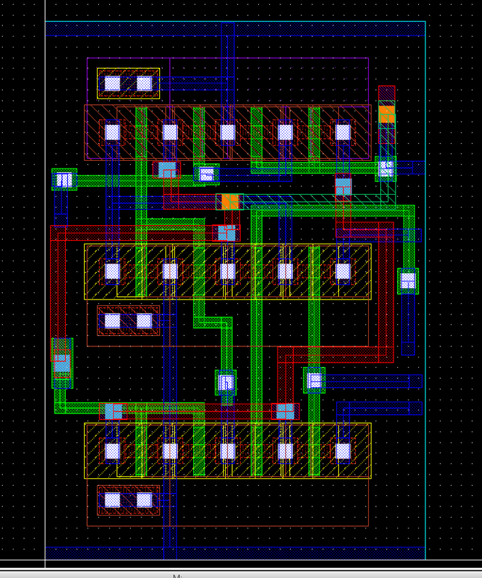
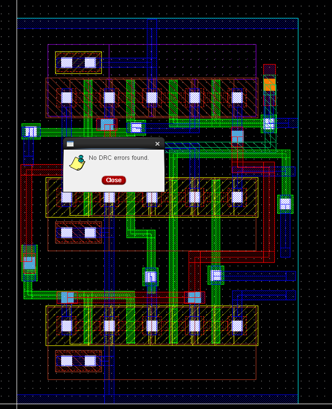
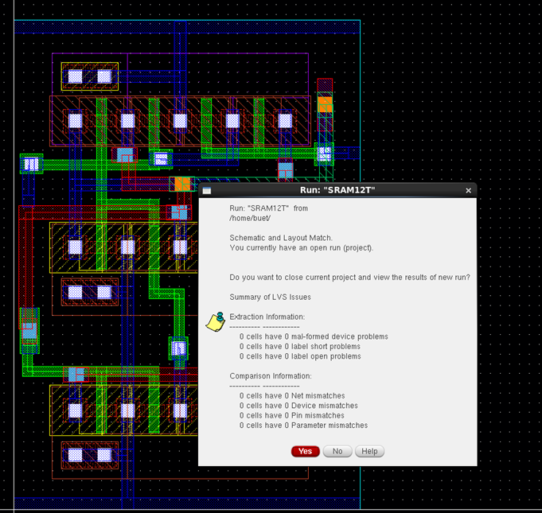
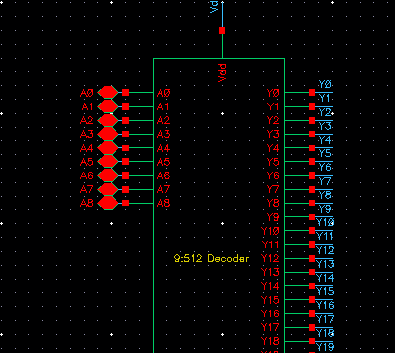
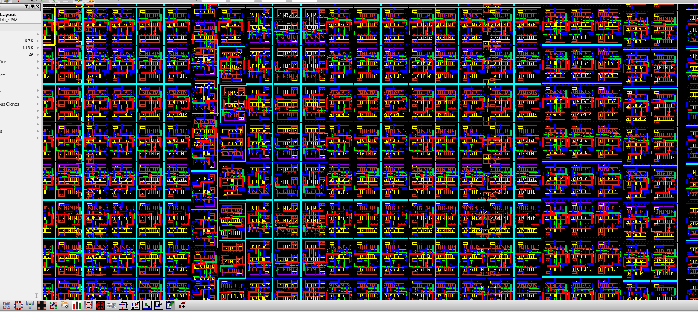

# Design of 4Kb SRAM Using Noble Schmitt Trigger-Based 12T Bit Cell in GPDK 90nm Technology

This repository contains the complete **Senior Design Project (Final Year Project)** on the design and analysis of a **4Kb SRAM** using a **Noble Schmitt Trigger-Based 12T SRAM Bit Cell** in **GPDK 90nm Technology** using **Cadence Virtuoso**.

The project focuses on improving **SRAM Stability**, **Read/Write Reliability**, and **Noise Immunity** using a **Schmitt Trigger-Based 12T Architecture** with **Separate Read and Write Paths**.

---

# 📌 Introduction

Static Random Access Memory (**SRAM**) is widely used in high-speed memory applications due to its fast access time and low latency. However, conventional SRAM cells suffer from challenges such as reduced stability, read disturb issues, and poor noise immunity at scaled technologies.

This project proposes a **Schmitt Trigger-Based 12T SRAM Cell** to enhance:
- **Read Stability**
- **Write Reliability**
- **Noise Immunity**
- **Process Variation Tolerance**

The complete design was implemented and verified using **Cadence Virtuoso** in **GPDK 90nm CMOS Technology**.

---

# 🎯 Project Objectives

- Design a robust **12T SRAM Bit Cell**
- Improve **SRAM Stability**
- Reduce **Read Disturb Issues**
- Analyze **Read, Write, and Hold Operations**
- Evaluate **RSNM, HSNM, and WSNM**
- Perform **Monte Carlo Analysis**
- Implement **Custom Layout Design**
- Perform **DRC/LVS Verification**
- Perform **RC Extraction & Post-Layout Validation**

---

# 🛠️ Tools & Technologies Used

- **Cadence Virtuoso**
- **GPDK 90nm Technology**
- **CMOS VLSI Design**
- **Analog & Mixed Signal Simulation**
- **Custom Layout Design**
- **DRC / LVS Verification**
- **RC Extraction**

---

# 🧠 SRAM Architecture


<p align="center">
  
</p>

<p align="center">
  <b>Fig:-1. Proposed 12T SRAM Cell Architecture</b>
</p>

The proposed **12T SRAM Architecture** consists of:

The proposed **12T SRAM Architecture** consists of:
- Cross-Coupled Inverters
- Schmitt Trigger-Based Feedback
- Separate Read/Write Paths
- Differential Bitlines
- Enhanced Stability Structure

The architecture improves:
- **Read Stability**
- **Write Reliability**
- **Noise Immunity**
- **Process Variation Tolerance**

The architecture improves SRAM performance by increasing stability and reducing noise sensitivity during read and write operations.

---
# 🔷 Schematic Representation of Proposed 12T SRAM Cell

The schematic of the proposed **12T SRAM Cell** was designed and simulated using **Cadence Virtuoso** in **GPDK 90nm Technology**. The design incorporates a **Schmitt Trigger-Based Feedback Structure** with **separate read and write paths** to improve SRAM stability and reliability.


<p align="center">
  
</p>

<p align="center">
  <b>Fig:-2. Schematic Representation of Proposed 12T SRAM Cell in Cadence Virtuoso</b>
</p>
# 🔷 Symbolic Representation of Proposed 12T SRAM Cell

The symbolic representation of the proposed **12T SRAM Cell** was created in **Cadence Virtuoso** to simplify hierarchical design integration and simulation. The symbol includes all essential input, output, control, and power pins required for SRAM operations.

### 📌 Features of the Symbol
- **Compact and Modular Design**
- **Easy Hierarchical Integration**
- **Separate Read and Write Control Signals**
- **Differential Write Bitlines (BL / BLB)**
- **Dedicated Read Bitline (RBL)**
- **Power Supply Pins (VDD / GND)**
- **Storage Node Outputs (Q / QB)**

### 📌 Pins Description
- **WL** → Write Word Line
- **RWL** → Read Word Line
- **BL / BLB** → Differential Write Bitlines
- **RBL** → Read Bitline
- **Q / QB** → Stored Data Outputs
- **CONTROL** → Control Signal for SRAM Operation
- **VDD / GND** → Power Supply Connections

<p align="center">
  
</p>

<p align="center">
  <b>Fig:-3. Symbolic Representation of Proposed 12T SRAM Cell</b>
</p>


# 🔷 Pre-Layout Simulation of Proposed 12T SRAM Cell

The pre-layout simulation of the proposed **12T SRAM Cell** was performed in **Cadence Virtuoso** using **GPDK 90nm Technology** to verify the functional correctness of the SRAM architecture before physical layout implementation.

The simulation setup includes:
- **Power Supply Connections (VDD/GND)**
- **Control Signal Inputs**
- **Differential Write Bitlines (BL / BLB)**
- **Read Word Line (RWL)**
- **Read Bitline (RBL)**
- **Storage Node Outputs (Q / QB)**

### 📌 Objectives of Pre-Layout Simulation
- Verify SRAM functional operation
- Analyze Read, Write, and Hold operations
- Validate switching behavior of Q and QB
- Evaluate SRAM stability before layout generation
- Ensure proper operation of control and read/write paths

### 📌 Features Verified
- Correct Read Operation
- Successful Write Operation
- Stable Hold Condition
- Differential Bitline Functionality
- Proper Read Bitline Response

<p align="center">
  
</p>

<p align="center">
  <b>Fig:-4. Pre-Layout Simulation Setup of Proposed 12T SRAM Cell</b>
</p>

# 🔷 Transient Analysis

Transient analysis of the proposed **12T SRAM Cell** was performed in **Cadence Virtuoso** to verify the dynamic behavior of the SRAM during **Read**, **Write**, and **Hold** operations.

The simulation demonstrates the switching characteristics of:
- **Word Line (WL)**
- **Bitlines (BL / BLB)**
- **Read Bitline (RBL)**
- **Storage Nodes (Q / QB)**

### 📌 Objectives of Transient Analysis
- Verify read operation
- Verify write operation
- Analyze hold stability
- Observe switching behavior of storage nodes
- Evaluate dynamic SRAM performance

### 📌 Observations
- Successful data writing and retention
- Proper complementary switching of Q and QB
- Stable read operation through RBL
- Reliable transient response

<p align="center">
  
</p>

<p align="center">
  <b>Fig. Transient Analysis of Proposed 12T SRAM Cell</b>
</p>


# 🔷 DC Simulation for Butterfly Curve and SNM Evaluation

DC simulation was performed in **Cadence Virtuoso** using **GPDK 90nm Technology** to evaluate the stability of the proposed **12T SRAM Cell** through butterfly curve analysis.

The butterfly curve was obtained by plotting the voltage transfer characteristics (VTC) of two cross-coupled inverters. The maximum square that can fit inside the butterfly curve represents the **Static Noise Margin (SNM)** of the SRAM cell.

### 📌 Objectives of DC Simulation
- Evaluate SRAM stability
- Measure Static Noise Margin (SNM)
- Analyze read and hold stability
- Verify noise immunity of the SRAM cell

### 📌 Parameters Evaluated
- **Read Static Noise Margin (RSNM)**
- **Hold Static Noise Margin (HSNM)**
- **Write Static Noise Margin (WSNM)**

### 📌 Features Observed
- Improved SRAM stability
- Better noise tolerance
- Enhanced reliability under process variations

<p align="center">
  
</p>

<p align="center">
  <b>Fig. DC Simulation for Butterfly Curve and SNM Evaluation of Proposed 12T SRAM Cell</b>
</p>

# 🔷 Monte Carlo Analysis of Proposed 12T SRAM Cell

Monte Carlo analysis was performed in **Cadence Virtuoso** using **GPDK 90nm Technology** to evaluate the impact of process variations on the stability and reliability of the proposed **12T SRAM Cell**.

The analysis helps in verifying the robustness of the SRAM cell under random variations in transistor parameters such as:
- Threshold Voltage Variations
- Channel Length Variations
- Oxide Thickness Variations
- Process Corners

Monte Carlo simulations were carried out for:
- **Write Static Noise Margin (WSNM)**
- **Hold Static Noise Margin (HSNM)**
- **Read Static Noise Margin (RSNM)**

The obtained results demonstrate improved SRAM stability and tolerance against manufacturing variations.

---

# 🔷 WSNM Monte Carlo Curve of 12T SRAM Cell

The Monte Carlo analysis for **Write Static Noise Margin (WSNM)** was performed to evaluate the write capability and reliability of the SRAM cell under process variations.

### 📌 Observations
- Stable write operation
- Improved write reliability
- Better tolerance against variations

<p align="center">
  
</p>

<p align="center">
  <b>Fig. WSNM Monte Carlo Curve of Proposed 12T SRAM Cell</b>
</p>

---

# 🔷 HSNM Monte Carlo Curve of 12T SRAM Cell

The Monte Carlo analysis for **Hold Static Noise Margin (HSNM)** was performed to verify the data retention capability of the SRAM cell during hold condition.

### 📌 Observations
- Stable data retention
- Improved hold stability
- Enhanced noise immunity

<p align="center">
  
</p>

<p align="center">
  <b>Fig. HSNM Monte Carlo Curve of Proposed 12T SRAM Cell</b>
</p>

---

# 🔷 RSNM Monte Carlo Curve of 12T SRAM Cell

The Monte Carlo analysis for **Read Static Noise Margin (RSNM)** was performed to evaluate the read stability of the SRAM cell under process variations.

### 📌 Observations
- Reliable read operation
- Reduced read disturb issues
- Improved read stability

<p align="center">
  
</p>

<p align="center">
  <b>Fig. RSNM Monte Carlo Curve of Proposed 12T SRAM Cell</b>
</p>

# 🔷 Dynamic Power Analysis of Proposed 12T SRAM Cell

Dynamic power analysis was performed in **Cadence Virtuoso** using **GPDK 90nm Technology** to evaluate the switching power consumption of the proposed **12T SRAM Cell** during SRAM operations.

The dynamic power consumption is mainly caused by:
- Charging and discharging of bitlines
- Wordline switching activity
- Internal node transitions

### 📌 Monte Carlo Analysis Results
- **Number of Samples** : 1000
- **Mean Dynamic Power** : 660.859 nW
- **Standard Deviation** : 14.4676 nW

### 📌 Observations
- Stable dynamic power distribution
- Reduced switching power consumption
- Improved power efficiency during SRAM operation

<p align="center">
  
</p>

<p align="center">
  <b>Fig. Monte Carlo Curve of Dynamic Power of Proposed 12T SRAM Cell</b>
</p>

---

# 🔷 Leakage Power Analysis of Proposed 12T SRAM Cell

Leakage power analysis was performed to evaluate the standby power consumption of the proposed **12T SRAM Cell** under idle conditions.

Leakage power mainly occurs due to:
- Subthreshold Leakage Current
- Gate Oxide Leakage
- Junction Leakage Current

### 📌 Monte Carlo Analysis Results
- **Number of Samples** : 1000
- **Mean Leakage Power** : 156.807 µW
- **Standard Deviation** : 5.13059 µW

### 📌 Observations
- Stable leakage power distribution
- Improved standby power efficiency
- Better low-power SRAM performance

<p align="center">
  
</p>

<p align="center">
  <b>Fig. Monte Carlo Curve of Leakage Power of Proposed 12T SRAM Cell</b>
</p>


# 📊 Simulations Performed

## ✅ Write Operation
- Verified successful data overwrite
- Evaluated **Write Static Noise Margin (WSNM)**

- 
## ✅ Hold Operation
- Verified stable data retention
- Evaluated **Hold Static Noise Margin (HSNM)**


## ✅ Read Operation
- Verified stable read functionality
- Evaluated **Read Static Noise Margin (RSNM)**

## ✅ Monte Carlo Analysis
- Process variation analysis
- Statistical reliability evaluation
- Dynamic and leakage power analysis

---

# 📈 Results

| Parameter | Value |
|------------|------------|
| **WSNM** | **664.59 mV** |
| **HSNM** | **430.80 mV** |
| **RSNM** | **309.07 mV** |

The proposed SRAM cell demonstrated:
- Improved Stability
- Better Noise Immunity
- Reliable Read/Write Operations
- Robust Performance under Process Variations

---

# 🧩 Physical Verification

Physical verification of the proposed **12T SRAM Cell** was performed in **Cadence Virtuoso** using **GPDK 90nm Technology** to ensure the correctness of the layout design and post-layout functionality.

The verification process included:
- **Layout Design**
- **Design Rule Check (DRC)**
- **Layout Versus Schematic (LVS)**
- **RC Extraction**

---

# 🔷 Layout Design of Proposed 12T SRAM Cell

The layout of the proposed **12T SRAM Cell** was designed using custom VLSI layout techniques in **Cadence Virtuoso**. Proper transistor placement and metal routing were implemented to achieve compact area and reliable performance.

### 📌 Features of the Layout
- Compact layout structure
- Optimized metal routing
- Separate read and write paths
- Differential bitline implementation
- Improved layout symmetry

<p align="center">
  
</p>

<p align="center">
  <b>Fig. Layout Design of Proposed 12T SRAM Cell</b>
</p>

---

# ✅ DRC (Design Rule Check)

Design Rule Check (**DRC**) was performed to verify that the layout follows all fabrication design rules defined by the **GPDK 90nm Technology**.

### 📌 DRC Results
- No DRC violations were found
- Layout satisfies all technology constraints
- Proper spacing and routing rules were maintained

<p align="center">
  
</p>

<p align="center">
  <b>Fig. DRC Verification Result of Proposed 12T SRAM Cell</b>
</p>

---

# ✅ LVS (Layout Versus Schematic)

Layout Versus Schematic (**LVS**) verification was performed to ensure that the generated layout exactly matches the schematic design of the proposed SRAM cell.

### 📌 LVS Results
- Layout successfully matched with schematic
- All device connections were verified
- No mismatch errors were found

<p align="center">
  
</p>

<p align="center">
  <b>Fig. LVS Verification Result of Proposed 12T SRAM Cell</b>
</p>

---

<p align="center">
  
</p>

<p align="center">
  <b>Fig. LVS Verification Result of Proposed 12T SRAM Cell</b>
</p>

---

# ✅ RC Extraction

RC Extraction was performed to extract parasitic resistance and capacitance from the layout for post-layout analysis.

### 📌 RC Extraction Results
- Parasitic resistance successfully extracted
- Parasitic capacitance successfully extracted
- Post-layout parasitic effects analyzed
- Improved timing and power estimation

<p align="center">
  
</p>

<p align="center">
  <b>Fig. RC Extraction Result of Proposed 12T SRAM Cell</b>
</p>

# 📂 Repository Structure

```text
├── Schematic/
├── Layout/
├── Simulations/
├── Monte_Carlo_Analysis/
├── DRC_LVS_Reports/
├── RC_Extraction/
├── Waveforms/
├── Final_Report/
└── Images/
```


# 🔷 Schmitt Trigger Concept in Proposed 12T SRAM Cell

The **Schmitt Trigger** is a regenerative comparator circuit that introduces **hysteresis** by using two different switching threshold voltages for rising and falling input signals. This hysteresis behavior improves the noise immunity and stability of the SRAM cell.

In the proposed **12T SRAM Architecture**, Schmitt Trigger feedback transistors are incorporated to strengthen the storage nodes and reduce the probability of unintended switching during read and hold operations.

---

# 📌 Hysteresis Concept

The Schmitt Trigger operates with:
- **Upper Threshold Voltage (\(V_{TH+}\))**
- **Lower Threshold Voltage (\(V_{TH-}\))**

The difference between these two threshold voltages forms the hysteresis window:

```math
\Delta V_H = V_{TH+} - V_{TH-}
```

This hysteresis behavior:
- Filters noise and glitches
- Prevents unwanted switching
- Improves logic stability
- Enhances SRAM robustness

---

# 📌 Role of Schmitt Trigger in SRAM

The Schmitt Trigger feedback mechanism improves SRAM performance by:
- Increasing **Read Static Noise Margin (RSNM)**
- Improving **Hold Static Noise Margin (HSNM)**
- Enhancing **Write Static Noise Margin (WSNM)**
- Reducing read disturb issues
- Improving tolerance against Process, Voltage, and Temperature (PVT) variations

---

# 📌 Advantages of Schmitt Trigger-Based SRAM

- Improved Noise Immunity
- Better Read Stability
- Reliable Data Retention
- Enhanced Low-Voltage Operation
- Reduced Probability of Bit Flipping
- Higher Stability under Process Variations

---

# 📊 Achieved Noise Margin Results

| Parameter | Value |
|---|---|
| **RSNM** | **309.1 mV** |
| **HSNM** | **430.8 mV** |
| **WSNM** | **664.6 mV** |

---

<p align="center">
  
</p>

<p align="center">
  <b>Fig. Schmitt Trigger Concept and Benefits in Proposed 12T SRAM Cell</b>
</p>


# 🚀 4Kb SRAM Architecture Using Proposed 12T SRAM Cell

After successful design and verification of the proposed **12T SRAM Cell**, a complete **4Kb SRAM Memory Architecture** was implemented using the designed SRAM bit cell in **Cadence Virtuoso** using **GPDK 90nm Technology**.

The 4Kb SRAM was developed by arranging multiple 12T SRAM cells in an array structure along with decoder circuitry, wordline control, bitline architecture, and peripheral circuitry.

---

# 📌 4Kb SRAM Organization

The total memory size of the SRAM is:

```math
4Kb = 4096 \ bits
```

The memory array was organized as:

```math
512 \times 8
```

Where:
- **512 Rows**
- **8 Columns**
- Total Bits = \(512 \times 8 = 4096\) bits

---

# 🧠 Architecture of 4Kb SRAM

The proposed 4Kb SRAM architecture consists of:
- **12T SRAM Bit Cell Array**
- **9:512 Row Decoder**
- **Wordline Drivers**
- **Bitline and Read Bitline Structure**
- **Read/Write Control Circuitry**
- **Peripheral Circuits**

### 📌 Key Features
- High Stability SRAM Architecture
- Separate Read and Write Paths
- Improved Noise Immunity
- Reliable Read/Write Operations
- Low Power Consumption
- Enhanced Process Variation Tolerance

<p align="center">
  
</p>

<p align="center">
  <b>Fig. Architecture of Proposed 4Kb SRAM Using 12T SRAM Cell</b>
</p>

---

# 🔷 9:512 Decoder Design

A **9:512 Decoder** was designed to select one wordline among 512 rows in the SRAM array.

### 📌 Decoder Features
- 9 Input Address Lines
- 512 Wordline Outputs
- Row Selection Mechanism
- Optimized Decoder Structure

The decoder activates only one wordline at a time based on the applied address input.

<p align="center">
  
</p>

<p align="center">
  <b>Fig. 9:512 Decoder Design for 4Kb SRAM</b>
</p>

---

# 🔷 SRAM Array Implementation

The SRAM array was created by arranging multiple 12T SRAM cells in matrix form to achieve the required memory capacity.

### 📌 Array Features
- Matrix-Based Cell Placement
- Optimized Wordline Routing
- Differential Bitline Structure
- Compact Layout Organization

<p align="center">
  
</p>

<p align="center">
  <b>Fig. 4Kb SRAM Array Using Proposed 12T SRAM Cells</b>
</p>

---

# 📊 Functional Verification of 4Kb SRAM

Functional simulations were performed to verify:
- Correct Address Decoding
- Read Operation
- Write Operation
- Stable Data Retention
- Proper Wordline Activation

---

# 🔷 Precharge Circuit for Proposed 4Kb SRAM

A precharge circuit was designed and integrated into the proposed **4Kb SRAM Architecture** to initialize the bitlines before every read operation. The precharge circuit equalizes and charges the bitlines to the supply voltage level, ensuring reliable and faster read functionality.

The precharge operation is controlled using a dedicated **Precharge Control Signal**.

---

# 📌 Functions of Precharge Circuit

- Charges bitlines to **VDD**
- Equalizes differential bitlines
- Improves read speed
- Reduces sensing delay
- Enhances read stability
- Minimizes read errors

---

# 📌 Precharge Circuit Features

- Dedicated precharge control signal
- Simultaneous charging of all bitlines
- Supports differential bitline architecture
- Improves SRAM read reliability
- Optimized for low-power SRAM operation

---

# 📌 Working Principle

During the precharge phase:
- The **Precharge Signal** is activated
- All bitlines are charged to **VDD**
- Differential bitlines are equalized

During the read/write operation:
- The precharge signal is disabled
- Bitlines are released for SRAM access operations

---

# 📌 Advantages of Precharge Circuit

- Faster Read Operation
- Reduced Bitline Delay
- Improved Sense Amplifier Performance
- Better Noise Immunity
- Enhanced SRAM Stability

<p align="center">
  
</p>

<p align="center">
  <b>Fig. Precharge Circuit for Proposed 4Kb SRAM Architecture</b>
</p>


# 🔷 Sense Amplifier and Read Output Buffer

The proposed **4Kb SRAM Architecture** incorporates a **Sense Amplifier** and **Read Output Buffer** to improve the speed, reliability, and accuracy of the read operation.

The sense amplifier detects small voltage differences developed on the differential bitlines during the read operation and converts them into full logic-level signals. The read output buffer then strengthens the sensed data and provides stable output signals.

---

# 📌 Sense Amplifier

The sense amplifier is used to amplify the small differential voltage generated between the bitlines during the SRAM read operation.

### 📌 Functions of Sense Amplifier
- Detects small voltage differences on bitlines
- Amplifies weak read signals
- Converts differential signals into digital outputs
- Improves read speed and sensitivity

### 📌 Features of Sense Amplifier
- High-Speed Read Operation
- Differential Bitline Sensing
- Improved Read Accuracy
- Reduced Read Delay
- Enhanced Noise Immunity

### 📌 Working Principle
- Bitlines are precharged before read operation
- During read access, a small voltage difference develops
- The sense amplifier detects and amplifies this difference
- Logic output is generated at the amplifier output nodes

---

# 📌 Read Output Buffer

The read output buffer is connected after the sense amplifier to drive the final SRAM outputs with improved signal strength and stability.

### 📌 Functions of Read Output Buffer
- Strengthens sensed output signals
- Provides stable logic outputs
- Drives external load capacitance
- Improves output reliability

### 📌 Features of Read Output Buffer
- Fast Output Response
- Stable Digital Output
- Improved Driving Capability
- Reduced Signal Distortion

---

# 📌 Advantages of Sense Amplifier and Output Buffer

- Faster Read Access Time
- Improved Read Reliability
- Enhanced Noise Immunity
- Stable Output Voltage Levels
- Reduced Read Delay

<p align="center">
  
</p>

<p align="center">
  <b>Fig. Sense Amplifier and Read Output Buffer for Proposed 4Kb SRAM</b>
</p>

# 📷 Project Includes

- 12T SRAM Schematic
- SRAM Symbol Design
- Layout Design
- Read/Write/Hold Waveforms
- Monte Carlo Simulation Results
- DRC/LVS Reports
- RC Extraction Results

---


# 🧩 Layout Implementation of Proposed 4Kb SRAM

The complete layout of the proposed **4Kb SRAM** was implemented in **Cadence Virtuoso** using **GPDK 90nm Technology**. The layout was generated by arranging multiple **12T SRAM Cells** in matrix form along with peripheral circuits such as:
- Decoder
- Precharge Circuit
- Sense Amplifier
- Read Output Buffer
- Wordline and Bitline Routing

The SRAM array was organized in a compact structure to optimize:
- Area utilization
- Routing efficiency
- Read/Write performance
- Power consumption

---

# 📌 Features of the Layout

- Matrix-Based SRAM Cell Arrangement
- Optimized Wordline and Bitline Routing
- Compact Layout Structure
- Differential Bitline Architecture
- Separate Read and Write Paths
- Improved Stability and Noise Immunity

---

# 📌 Physical Verification Performed

### ✅ DRC (Design Rule Check)
- No DRC violations found
- Layout satisfies all GPDK 90nm design rules

### ✅ LVS (Layout Versus Schematic)
- Layout successfully matched with schematic
- All device connections verified successfully

### ✅ RC Extraction
- Parasitic resistance and capacitance extracted
- Post-layout effects analyzed successfully

---

# 📌 Advantages of Proposed Layout

- Compact Memory Architecture
- Reliable SRAM Operation
- Improved Routing Organization
- Better Read/Write Stability
- Enhanced Low-Power Performance

<p align="center">
  
</p>

<p align="center">
  <b>Fig. Layout Implementation of Proposed 4Kb SRAM Using 12T SRAM Cells</b>
</p>

# 🎯 Applications

- Cache Memory
- Embedded Systems
- Low-Power VLSI Systems
- High-Speed SRAM Arrays
- Radiation-Hardened Electronics
- Space Applications

---

# 👨‍💻 Team Members

- **Sourabh Tyagi**
- **Garv Kumar Sharma**
- **Aditya Thakur**

---

# 🙏 Acknowledgement

Special thanks to **Dr. Praveen Maurya** and the **School of Electronics Engineering, VIT-AP University** for continuous guidance and support throughout this project.

---

# ⭐ Conclusion

The proposed **Schmitt Trigger-Based 12T SRAM Architecture** successfully improved:
- SRAM Stability
- Noise Immunity
- Read/Write Reliability

The project demonstrated robust performance through **pre-layout and post-layout simulations**, making it suitable for **low-power and high-reliability SRAM applications**.

---

# 🔗 Keywords

`SRAM` `12T SRAM` `Cadence Virtuoso` `GPDK90nm` `CMOS` `VLSI` `Schmitt Trigger` `Memory Design` `Layout Design` `DRC` `LVS` `RC Extraction` `Monte Carlo Analysis` `Low Power VLSI`
